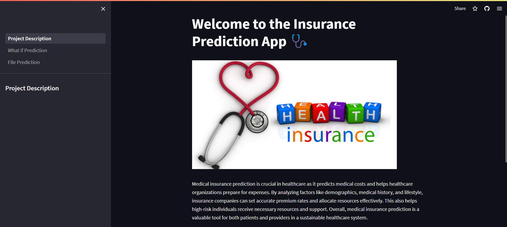
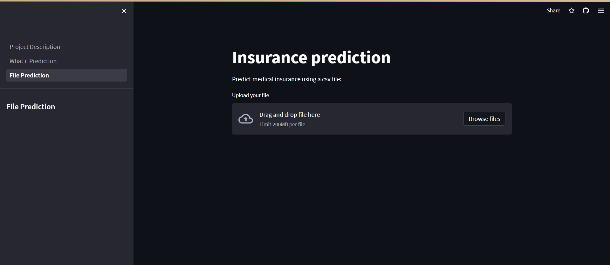

# Insurance-APP

Welcome to Insurance APP

An application that forecasts medical insurance, predicting medical costs and helping healthcare organizations prepare for expenses.

Features:

- Individual Predictions: Get personalized health insurance predictions tailored to your specific needs and circumstances.
- Batch Predictions: For businesses and organizations, our app offers efficient batch processing, allowing you to make predictions for multiple individuals at once.

---

## Project Description Page

## Individual Prediction Page

## Batch Prediction Page

---

<i>Contato</i>  
 

